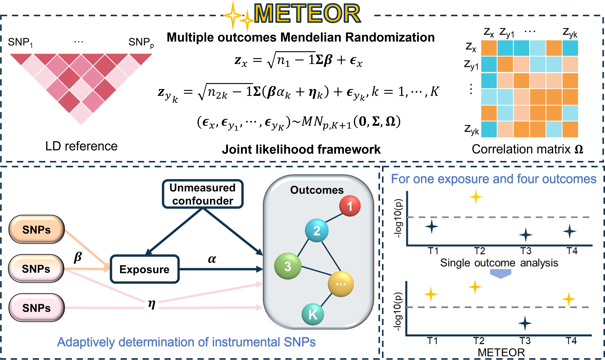

## METEOR Overview

METEOR is an R package for efficient statistical inference of multi-outcomes mendelian randomization analysis for the identification of shared and outcome-specific exposures. METEOR jointly models one exposure and multiple outcomes, accounts for sample overlap between the exposure and outcomes as well as among outcomes, allows the outcomes to be from different GWAS datasets, self-adaptively selects IVs from a set of correlated SNPs, and efficiently models the horizontal pleiotropy. METEOR places the inference of the causal effects into a joint likelihood-framework and relies on a scalable sampling-based algorithm to obtain calibrated $p$-values,freely available at <https://github.com/Liye222/METEOR>. 

Installation
------------
You can install the released version of MAPLE from Github with the following code. This package is supported for Windows 10/11, and Linux. The package has been tested on the following systems:
* Windows 10, 11
* Linux: Ubuntu (22.04.4)

### Dependencies 
* R version >= 3.6.0
* R packages: R packages: Rcpp, RcppArmadillo, RcppDist, dplyr, magrittr, readr, parallel


### 1. Install `devtools` if necessary
```r
install.packages('devtools')
```

### 2. Install `METEOR`
```r
devtools::install_github('Liye222/METEOR')
```
### 3. Load package
```r
library(METEOR)
```

### Issues
All feedback, bug reports and suggestions are warmly welcomed! Please make sure to raise issues with a detailed and reproducible example and also please provide the output of your sessionInfo() in R! 


How to use `METEOR`
-------------------

The METEOR User Manual: [here](https://github.com/Liye222/METEOR/blob/main/docs/METEOR_user_manual.pdf).

